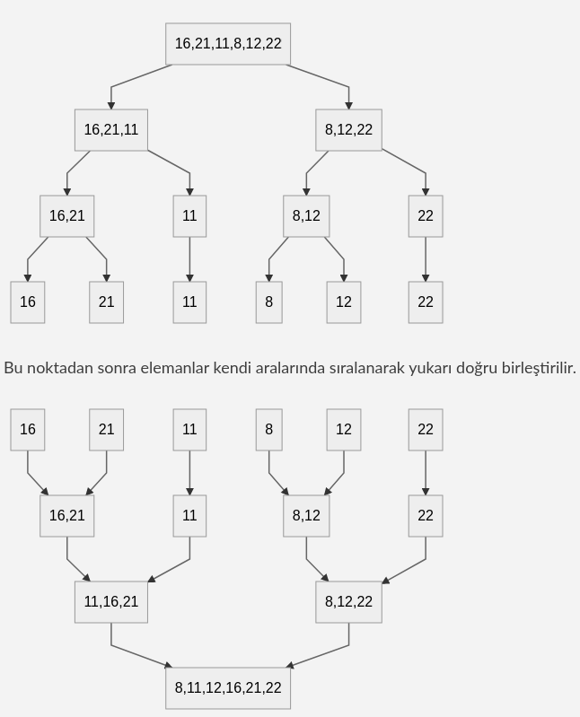

# Merge Sort

### Merge Sort nedir?

Merge sort en verimli sıralama algoritmalarından biridir ve divide and conquer paradigmasına dayanır.

* Her döngüde problem iki alt probleme bölünür
 * Divide and conquer yaklaşımı şu şekilde ifade dilebilir;
        * Divide: Problem seti tek elemana düşene kadar, problem, her dögüde iki alt parçaya böl.
        * Conquer: aralarında sıralanmış dizileri orijinal diziye birleştir.

Aşağıdaki Array'ı merge sort kullanarak sıralamak istediğimizde;

| index | 0 | 1 | 2 | 3 | 4 | 5 |
| :----: | :----: | :----: | :----: | :----: | :----: | :----: |
| array | 16 | 21 | 11 | 8 | 12 | 22 |




#### Time Complexity
* Worst case durumunda her geçişte array iki parçaya bölündüğünden ``` log n ``` işlem yaparken bu işlemi ``` n``` kadar yapmakadır. Bunun sonucunda Merge Sort ``` O(nlogn)``` zaman komplesitesine sahip olur.
* Best case durumu verilen array'ın sıralı olması durumudur.
	* Best Case ```O(nlogn)```
	* Average Case ```O(nlogn)```
	* Worst Case ```O(nlogn)```
#### Space Complexity
Array'ın alt array'ere bölünme işlemleri sırasında array'ın kendisi haricinde alan ihtiyacı olacaktır. Bu da ```O(n)``` kadar ilave alan kullanmayı gerektirir.